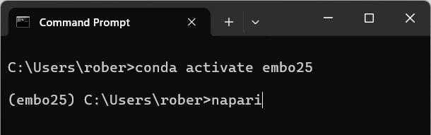
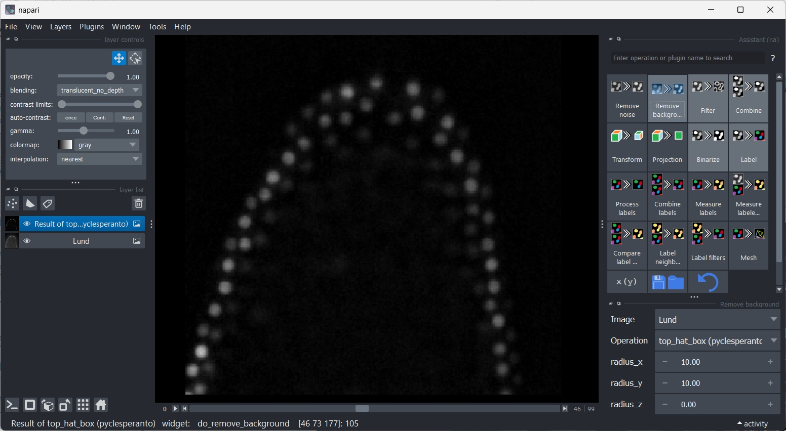
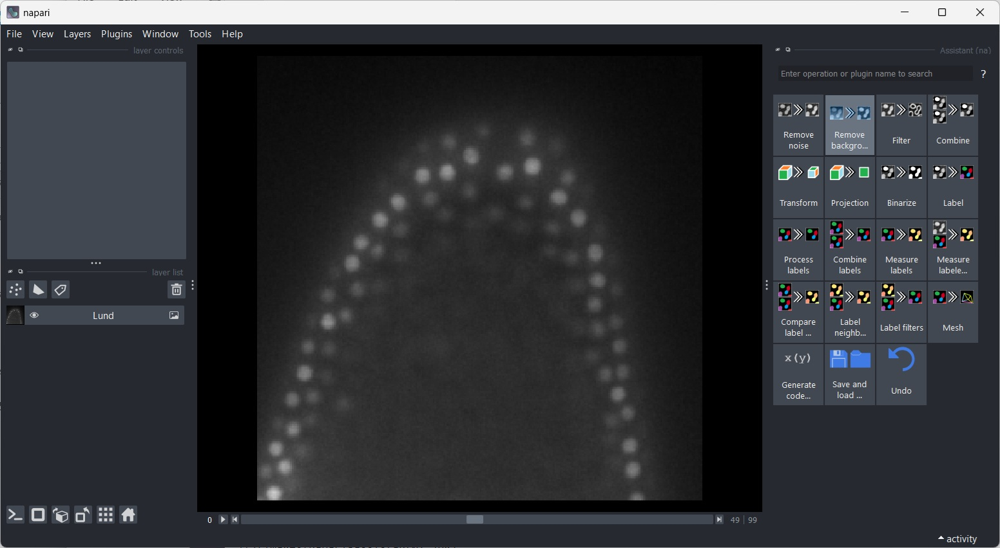
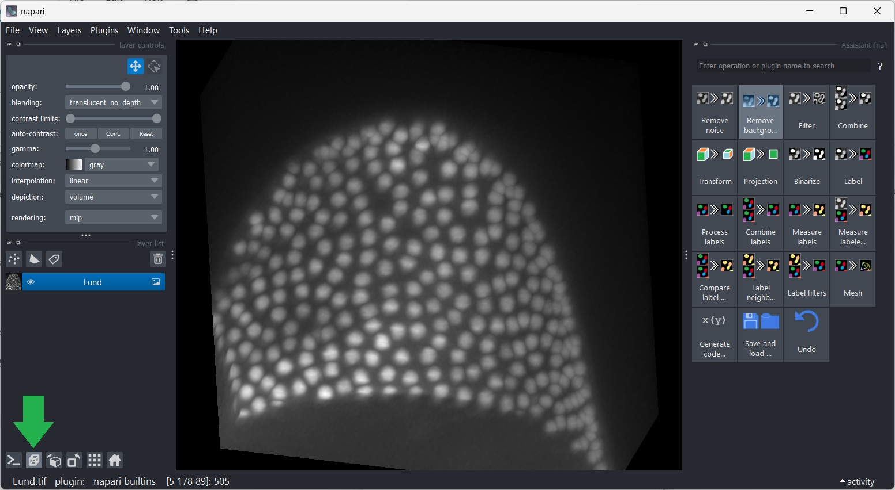
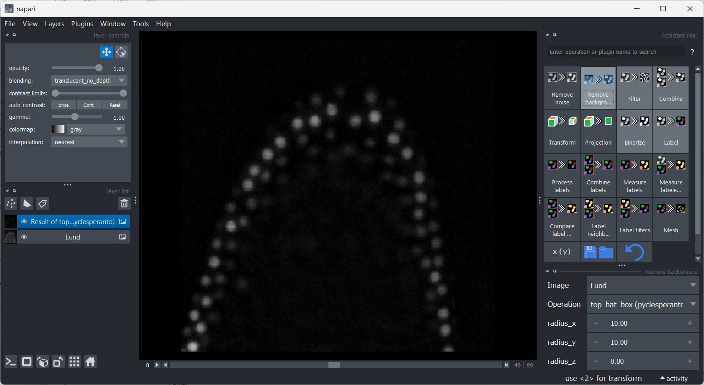
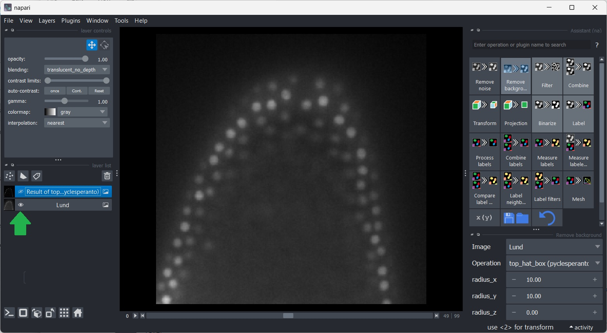
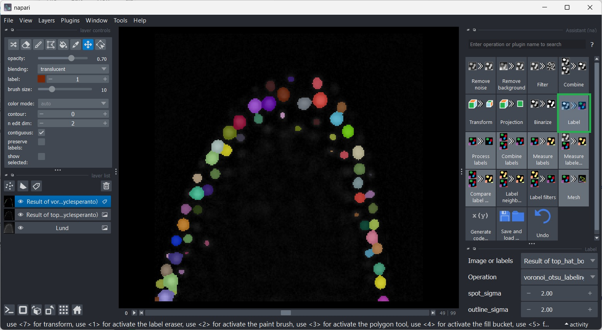
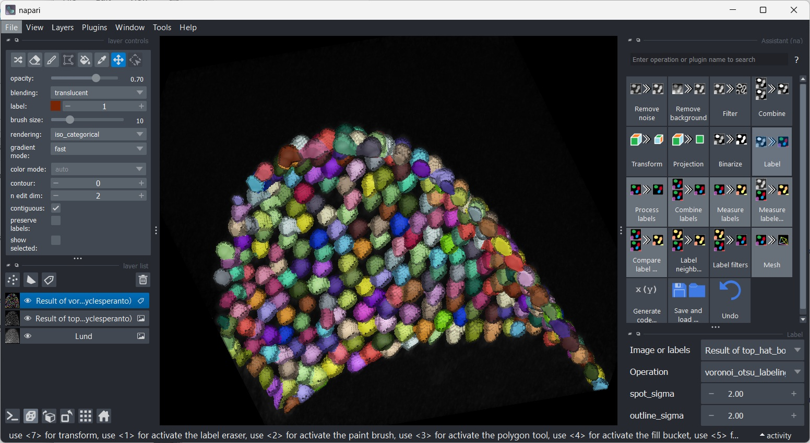
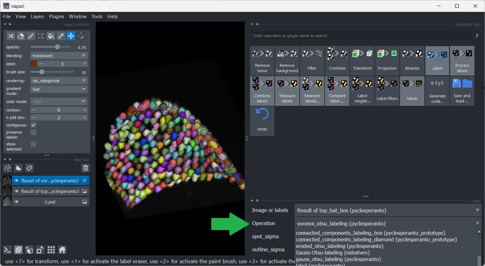

# The Napari Assistant

The Napari Assistant is a plugin for napari that allows you setting up an image processing workflow.

Start Napari from the command line like this:

```bash
conda activate embo25

napari
```



The napari window will open. Start the Napari Assistant from the `Tools > Utilities > Assistant (na)` menu.



 Drag & drop Lund.tif ([Download here](../01_juypter_notebooks/data/Lund.tif))



You can explore this dataset by clicking on the `2D/3D` view button.



Within the `Assistant` panel, click on the `Remove background` button.



Click on the `Eye` buttons in the layer list to switch between the original image and the result of the `Remove background` step.



Click on the `Label` button in the Assistant panel to add a new step to the workflow that generates a label image from the current layer.



Toggle 2D/3D view and layer visibility to explore the result of the `Label` step.



After switching back to 2D view, click the `Label` button in the Assistant and choose the operation `Connected component labeling (clEsperanto)`.

Explore other options and parameters.




